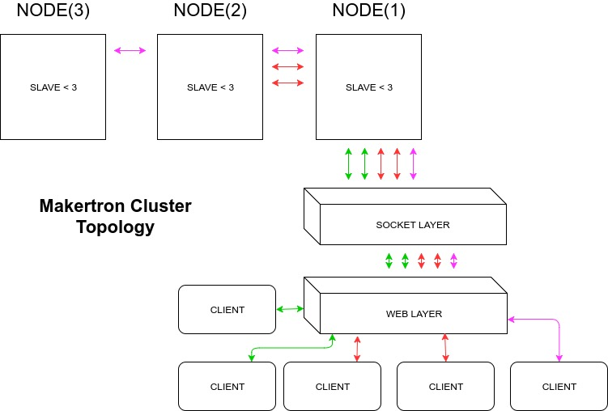

<h1>General Over View</h1>

The Makertron is a constructive solids engine that aims to fill the gap between traditional 'UI' driven cad tools and specification driven manufacturing environments. 

It features a decoupled philosophy and is designed to scale across hardware. 

The constructive geometry server portion of the makertron deals in stacks of geometrical operations and the client server deals with the complex business of parsing and managing user interaction. 

This is in sharp contrast to the OpenSCAD project design where the interface and geometry engine are tightly coupled and issues of speed and scale are readily apparent and non trivial to solve. 

The Makertron aims to be OpenSCAD compatible while fixing some ambiguities in the OpenSCAD language itself and shifting the parsing of the language to what we deem to be a more 'solid' parsing core through the addition of a transpiler. 

This will result in better error checking and more flexibility in the language without significant parser development overhead.

<h2>Demonstration</h2>

You can play with the live demo <a href="http://makertron.io">makertron.io</a> 

<h2>How Do I Build It Stand Alone</h2>

0. The makertron client server does not support Windows. 

1. You will need to install both CGAL and OpenCascade. 

	1. Download  <a href="https://www.opencascade.com/content/open-cascade-technology-710-available-download-0">OpenCascade 7.1.0</a>. This takes awhile to build. Unfortunately OCE is only up to 6.9.1 and is only up to 6.9.1. Follow the configuration instructions for OpenCascade and make sure library is installed in a location searchable by path. 

	2. For Ubuntu sudo apt-get install libcgal-dev

3. git clone https://github.com/mixotricha/makertron 

4. cd makertron 

5. Edit the config.jsn 

{
	"VERSION"        : "5.0.3", 
	"SLAVE" 				 : true, 
	"SLAVE_ADDR"     : "makertron.io", 
	"SLAVE_PORT"     : 3000,
	"RELAY_ADDR"     : "",
	"RELAY_PORT"     : "", 
	"MASTER"         : true,
	"MASTER_PORT"    : "80",  	
	"MAX_CONN"       : 30 , 
	"HTTPS"          : false , 
  "HSKEY"          : "",  
  "HSCERT"         : ""
}

VERSION     - Version Number.  
SLAVE       - This node will serve geometry ( true ). 
SLAVE_ADDR  - Address of this node ( include regardless of if SLAVE === true ). Same address as client server if not clustering.  
SLAVE_PORT  - Port of slave ( include regardless of if SLAVE === true and must be open and accessible ). 
RELAY_ADDR  - Address of next node. Leave blank if running single node stand alone.
RELAY_PORT  - Port of next node. Must be different from SLAVE_PORT. Leave blank if running stand alone. 
MASTER      - If this node intends to serve the client front end ( true ).  
MASTER_PORT - Port that client front end will be served on. Typically port 80 or 443.  
MAX_CONN    - How many connections this node will support before forwarding to next node.     
HTTPS       - If the front end will be served with certificate 
HSKEY       - Path to key ( do not include in subdir of client ! ).  
HSCERT      - Path to certificate ( do not include in subdir of client ! ).  

6. ./install.sh 

7. Launch the makertron.js server.
	node makertron.js 

8. Repeat this configuration and installation process for each physical hardware node that you intend to serve geometry. 

9. Open a browser to the localhost or address of hardware serving client. As an alterative you can also test it with the cli_client. 

10. Have fun! 

<h2>Support Matrix</h2> 

Feature        | Available | state    | Note
---------------|-----------|----------|-------------------------------
sphere         | y         | stable   | Does not yet support $fd / $fn 
cube           | y         | stable   | Does not yet support $fd / $fn
cylinder       | y         | stable   | Does not yet support $fd / $fn
cone           | y         | stable   | Does not yet support $fd / $fn
polyhedron     | y         | stable   | Does not yet support $fd / $fn
polygon        | y         | stable   | Does not yet support $fd / $fn
circle         | y         | stable   | Does not yet support $fd / $fn
square         | n         | devel    |
union          | y         | stable   | 
intersection   | y         | stable   | 
difference     | y         | stable   |
linear_extrude | y         | unstable | Does not support twist yet 
rotate_extrude | n         | devel    | 
minkowski      | y         | unstable | Still testing 
hull           | n         | devel    | 
rotate         | y         | stable   |
translate      | y         | stable   |
scale          | y         | devel    | Still testing
color/colour   | n         | devel    |
module         | y         | stable   | 
function       | y         | unstable | Still testing 

* if/for/else/sin/cos/acos/assignments/equalities : Since this transpiles from OpenSCAD to JS all of JS ability -should- be available. 

<h2>Motivation</h2>
The Makertron has been developed because we simply have not been able to find a solids platform for constructive geometry generation that has a server side component and a client component and we realise that others are also in the same boat as ourselves. 

<h2>Makertron Server</h2> 

The Makertron server supports its own internal geometry engine based on a BREP representation. We have spent considerable time testing various alternate geometry engines and exploring the topology problems inherent in providing verifiable water tight consistent meshes at scale and speed. 

We have concluded that the <a href="https://www.opencascade.com/doc/occt-6.7.0/overview/html/occt_brep_format.html">BREP</a> representation 
is good for speed but we also acknowledge that some jobs are better performed by <a href="http://www.cgal.org/">CGAL</a>. Finding just the right balance between speed and quality and having a server that chucks real geometry around is what I want.  

One of the goals of the Makertron design philosophy is to have one clear clean rendering pipe line that produces consistent meshes all the way from the instantiation of the BREP equations all the way through to the requesting client while keeping the server and client loosely coupled. Recent milestone has been reached in passing backwards and forwards between the BREP and the CGAL. 

<li>Run as many cores of the server as you want.</li>
<li>Split your constructive geometry problems up how you want.</li>
<li>Interact with other systems and generate your constructive geometry code relative to those systems</li> 
 

This stands in contrast to OpenSCAD client model which features a plethora of complex rendering tricks to avoid creating geometry ( <a href="http://www.nigels.com/research/egsggh98.pdf">GoldFeather</a>) in order to try and manage the speed/quality challenge that all constructive geometry engines must face. 

Lastly the OpenSCAD parser while supporting an excellent CSG language ( though in some areas ambiguous ) is so glued to the code base which in turn is glued to the interface and supporting codde. 

It is our opinion that this effort has stalled and something new needed to be developed to address these issues. 

A few good efforts are being made at this and they may improve in the future. We are adding our own to the list. 

<a href="http://composition.al/blog/2017/07/30/what-do-people-mean-when-they-say-transpiler/">What Do People Mean When They Say Transpiler?</a>

<h4>A practical requirement for source code transformation systems is that they be able to effectively process programs written in a programming language. This usually requires integration of a full front-end for the programming language of interest, including source code parsing, building internal program representations of code structures, the meaning of program symbols, useful static analyses, and regeneration of valid source code from transformed program representations. <b>The problem of building and integrating adequate front ends for conventional languages (Java, C++, PHP, ...) may be of equal difficulty as building the program transformation system itself because of the complexity of such languages</b>. To be widely useful, a transformation system must be able to handle many target programming languages, and must provide some means of specifying such front ends.
</h4>

<h2>Makertron Client</h2> 

The Makertron Client is a demonstration interface written in <a href="https://facebook.github.io/react/">ReactJS</a> using <a href="Three.js.org">Three.js</a> to display generated geometry. One of the goals of the Makertron design philosophy was to 'decouple' the client interface from the geometry engine leaving you free to build a platform that meets whatever specific specialised requirements you have. 

The Makertron engine supports a sophisticated transpiler that currently supports the default parse target of the <a href="http://www.openscad.org">OpenSCAD</a> language. At least 0.00001% of the OpenSCAD language specification is now supported and we are in the robustness and compatibility testing phase. This of course needs to be backed up with unit tests. The 0.00001% number is based on having worked through the OpenSCAD documentation from the top to the bottom. It does not currently support the import/export options or text. 

*0.00001% because apparently this is all impossible and to hard :)
 
We are awaiting some new browser features ( OffScreenCanvas ) that will improve the web based client considerably. 

The Makertron architecture makes the following possible: 

<li>Clustering / Parallelisation of constructive geometry.</li> 
<li>Interaction with other parts of complex manufacturing pipeline becomes possible. Sensors. Databases. Physics systems.</li> 
<li>Customisation of the client becomes possible. Specific interfaces for logistics manufacturing and assembly tasks can be developed.</li> 
<li>Procedural parametric interfaces that push back through UI elements can 'push' back to the target constructive geometry language.</li>

<h2>What Are You Using It For?</h2>

We have things in the real world we actually want to build. The computational geometry problem is an annoying and frustrating obstruction in our way that we intend to solve so that we can move on to the business of building things for ourselves and others. Rocket Engines. Bicycle Frames. Chess Pieces. Toboggans. Pipe Flanges. You name it. All the things we want to build. We need this tool! 

<i>If we had known how difficult it was and that no decent solutions existed we probably would have found something else to do with the past 5? years of our life.</i> 

<h2>Desired Outcome</h2> 

The design goal is that with the Makertron client and server code you can develop complex constructive geometry at ‘scale’ and at ‘speed’ in a formal language. This is a step towards specification driven cad design. Because of the nature of this design multi core processing and parallelisation becomes possible. 

As Makertron develops it will gain the ability to manage complex assembly and production tasks from the start of the design pipe line all the way through to manufacturing. This will include quality operations on geometry. Easy connectivity with the Internet of things. All of the features that we should expect from any performant web aware modular 'modern' language. 

<h2>License</h2>
 Makertron is Free Software released under the <a href="http://www.gnu.org/licenses/gpl-2.0.html">General Public License version 2</a>. 

Makertron could not exist without the following beautiful and brilliant contributions of others: 
 
<li>OpenSCAD</li>
<li>OpenCascade</li>
<li>ReactJS</li>
<li>NodeJS</li>
 

Thank you for making so much that is wonderful possible.... 

Especially M. The love of my life. 

